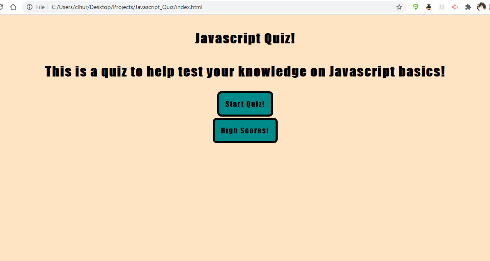
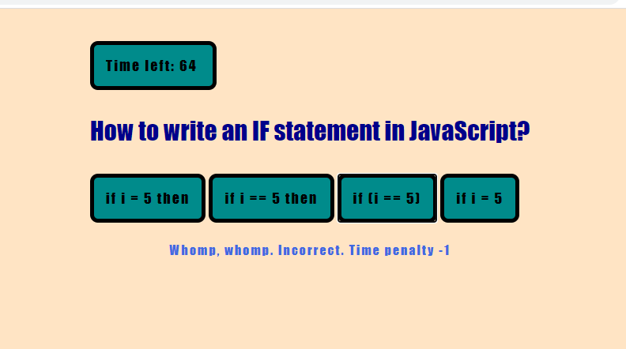
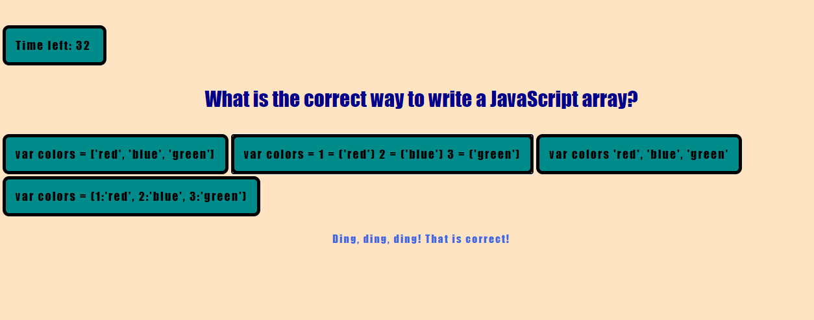

# Javascript_Quiz
A short quiz on Javascript, made with Javascipt

## Purpose
This is an exercise to create a timed, multiple choice quiz using HTML, CSS, and Javascript. 

## User Story 
```
AS A coding bootcamp student
I WANT to take a timed quiz on JavaScript fundamentals that stores high scores
SO THAT I can gauge my progress compared to my peers
```
## Built With
* HTML
* CSS
* Javascript 

## Website

GitPages Deployed URL : https://clhurlbut.github.io/Javascript_Quiz/

Github Repository URL : https://github.com/clhurlbut/Javascript_Quiz

## Screenshot





## References 

* https://www.w3schools.com/js/
* https://developer.mozilla.org/en-US/docs/Web/API/


## Contribution
Made with :potato: by Cassie Hurlbut for UCLA Coding Bootcamp / Trilogy 

##### Thank you UCLA Coding Bootcamp / Trilogy! 